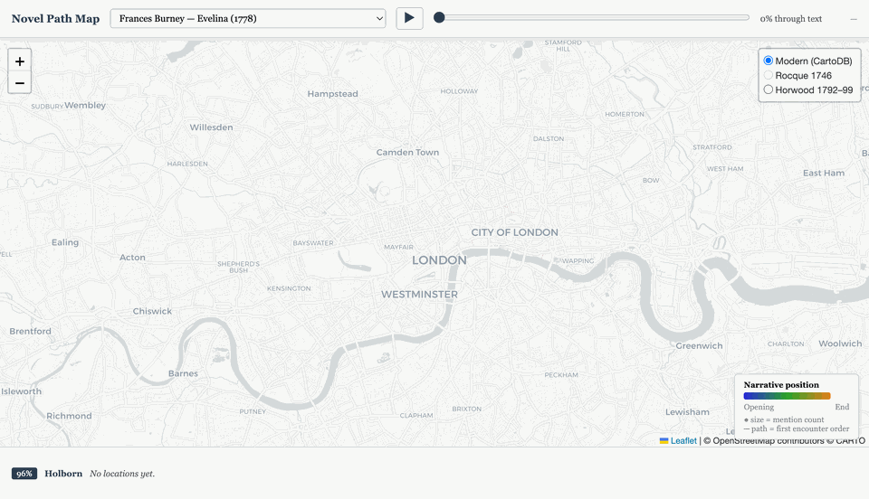

# 18th-Century English Novel Corpus

A digital humanities text corpus containing 18th and early 19th-century English novels sourced from Project Gutenberg, with computational authorship attribution research.

## Overview

This repository contains:
1. **Text Corpus**: 28+ novels from 13 authors (1719-1814)
2. **Authorship Attribution System**: BERT-based deep learning model achieving 99.9% accuracy
3. **Anonymous Attribution Testing**: Tests on works published "By a Lady" and anonymously

## Quick Stats

- **13 authors**: Austen, Burney, Radcliffe, Smith, Haywood, Reeve, Edgeworth, Richardson, Fielding, Smollett, Walpole, Lewis, Beckford
- **28+ texts**: ~4M words total
- **8 anonymous test cases**: Works originally published anonymously
- **99.8% accuracy**: BERT correctly identifies authors from anonymous works

## Repository Structure

```
DigHums/
├── [Author Directories]/     # 13 author folders with texts
│   ├── JaneAusten/
│   ├── FrancesBurney/
│   ├── AnnRadcliffe/
│   └── ... (10 more)
│
├── burney-attribution/        # ML authorship attribution project
│   ├── scripts/               # Training and testing scripts
│   ├── results/               # Test results (99.9% accuracy)
│   ├── README.md              # Detailed project documentation
│   └── ROADMAP.md             # Research phases and future work
│
├── gazetteer/                 # Urban geography of 18c fiction
│   ├── venues.csv             # 95 venues (London + Bath) with coordinates
│   ├── validate_venues.py     # Corpus scanner and mention extractor
│   ├── mentions.json          # Aggregate venue data (50 venues, 637 mentions)
│   ├── narrative_mentions.json # Per-text position-ordered events (24 texts)
│   ├── build_map.py           # Folium aggregate map builder
│   ├── map.html               # Interactive aggregate map (open in browser)
│   ├── build_narrative_map.py # Leaflet narrative path map builder
│   ├── narrative_map.html     # Interactive narrative path map
│   └── evelina_narrative.gif  # Animated walkthrough of Evelina's London circuit
│
├── CORPUS_CATALOG.md          # Complete text catalog with attribution details
├── CORPUS_EXPANSION_REPORT.md # Corpus expansion documentation
└── CLAUDE.md                  # Repository guide for AI assistants
```

## Key Features

### 1. Urban Gazetteer & Interactive Maps

A hand-curated gazetteer of 95 venues in London and Bath — pleasure gardens, theatres, assembly rooms, coffee houses, clubs, streets, prisons, markets, rookeries, and execution sites — with mention counts extracted from every text in the corpus.

**Aggregate map** (`gazetteer/map.html`): all venues sized by √(mention count), coloured by type, with historical tile layers (Rocque 1746, Horwood 1792–99). Click any marker for a per-text breakdown.

**Narrative path map** (`gazetteer/narrative_map.html`): trace how any novel moves through urban space in reading order. A timeline slider steps through the text; a colour gradient (blue → orange) encodes narrative position; marker size encodes cumulative mention count.



*Frances Burney, Evelina (1778) — 97 location mentions across 16 venues. Vauxhall Gardens dominates the opening movement; the West End polite circuit fills in at the centre; plebeian counter-venues (White-Conduit House, Bagnigge Wells) cluster north and east as the Branghton subplot develops.*

### Venue Explorer (`gazetteer/venue_explorer.html`)

Interactive map of the sensory evidence store. Click any venue to browse assembled
passages filtered by modality (auditory, olfactory, visual, thermal, crowd), source
type (fiction, diary, topography, poetry, letters, **legal**), and date range (1660–1820).

Built from `sensory.db` — 8,515 deduplicated passages across 37+ sources, 981 passages
geocoded to 57 venues (565 from literary/diary sources via geocoder; 416 from Old Bailey
Proceedings assigned directly to 19 legal venues). Each passage carries a valence tag
(`pleasant` / `neutral` / `unpleasant`). Top venues by passage count: City of London (89),
King's Theatre (74), Ranelagh (43), Vauxhall (34), Bridewell Prison (75), Smithfield (76).

**Phase 2 (Old Bailey)** adds 22 new venue types absent from the literary corpus — prisons,
courts, markets, rookeries, and execution grounds — sourced from nuisance prosecutions and
trial transcripts (1660–1820). Legal passages default to `valence=unpleasant` on the
rationale that prosecution implies a sensory threshold crossed.

To regenerate after updating `sensory.db`:
```bash
python3 gazetteer/build_venue_explorer.py
```

**Selected findings:**
- Vauxhall Gardens: 53 mentions across 9 texts — the single most-referenced venue in the corpus
- Harley Street: 25 mentions, Burney and Austen only — same address, same social coding (cold professional ambition) in *Cecilia* and *Sense and Sensibility*
- Named coffee houses (Will's, Button's, Lloyd's, etc.): zero mentions after 1778 — the coffee house disappears from the novel as a social institution
- Plebeian venues in *Evelina* cluster as a counter-geography to the polite circuit, encoding class anxiety spatially

### Sensory Time Map (`gazetteer/sensory_time_map.html`)

Time-parameterised companion to the venue explorer. Set a year (1660–1820),
month, day-of-week, and time band (Dawn / Morning / Midday / Afternoon /
Evening / Night); venues respond in real time with intensity overlays drawn
from a curated dataset of 19+ recurring events — weekly markets, annual fairs,
execution days, civic processions, and seasonal venue operations.

Toggle the **literary layer** to overlay textual evidence from `sensory.db`
at the selected venue for comparison: what the institutional record predicts
vs. what novelists, diarists, and trial transcripts actually say.

To regenerate:

    python3 gazetteer/extract_events.py --write   # load/refresh events
    python3 gazetteer/build_sensory_time_map.py   # rebuild HTML

### 2. Comprehensive Corpus

- Balanced representation of **women authors** (7 of 13)
- Multiple genres: Gothic, Domestic, Epistolary, Picaresque, Amatory
- Spans formative period of English novel (1719-1814)

### 3. Anonymous Attribution Research
Many texts were originally published anonymously:
- Frances Burney - *Evelina* (1778): "By a Lady"
- Ann Radcliffe - *Castles of Athlin and Dunbayne* (1789): Anonymous
- Maria Edgeworth - *Castle Rackrent* (1800): Anonymous
- Horace Walpole - *Castle of Otranto* (1764): "By Onuphrio Muralto"

Our BERT model achieves **99.8% accuracy** identifying these authors from their anonymous works.

### 4. State-of-the-Art ML System
- Fine-tuned BERT (bert-base-uncased)
- 99.9% test accuracy on 7-author corpus
- Stratified train/val/test splitting
- Robustness testing on out-of-sample authors

## Research Highlights

**Key Finding**: BERT learns authorial style that transcends publication attribution:
- ✅ Identifies Burney from "By a Lady" publication (100% accuracy)
- ✅ Identifies Radcliffe from anonymous debut (88% accuracy)
- ✅ Distinguishes authors within genres (Burney vs Austen)

**Current Limitation**: Model shows genre/author correlation (Gothic → Radcliffe, Domestic → Burney), suggesting it learns both individual style and genre conventions.

## Getting Started

### Using the Corpus

All texts are in UTF-8 plain text format (.txt) from Project Gutenberg:

```bash
# Example: Read Pride and Prejudice
cat JaneAusten/PrideAndPrejudice.txt

# List all texts by author
ls -lh [Author]/*.txt
```

See `CORPUS_CATALOG.md` for complete text listings with publication dates and attribution status.

### Running the Attribution Model

See `burney-attribution/README.md` for detailed instructions on:
- Training the BERT model
- Testing on anonymous works
- Expanding to 13 authors
- Reproducing results

## Use Cases

This corpus is suitable for:
- **Authorship attribution** research
- **Stylometric analysis**
- Gender and authorship studies
- Historical text analysis
- NLP/ML training datasets
- Digital humanities pedagogy
- Comparative literary studies

## Documentation

- `CORPUS_CATALOG.md` - Complete text inventory with attribution details
- `CORPUS_EXPANSION_REPORT.md` - Details on recent corpus expansion
- `burney-attribution/README.md` - ML system documentation
- `burney-attribution/ROADMAP.md` - Research phases and future work
- `gazetteer/venues.csv` - Hand-curated venue list with coordinates, dates, and notes
- `CLAUDE.md` - Repository guide and coding conventions

## Citation

If you use this corpus or attribution system in your research, please cite:

```
Waterfield, D. (2025). 18th-Century English Novel Corpus with BERT Authorship Attribution.
GitHub repository. https://github.com/[username]/DigHums
```

## License

- **Code**: MIT License (see LICENSE)
- **Texts**: Public domain via Project Gutenberg

All literary texts are sourced from Project Gutenberg and are in the public domain. See https://www.gutenberg.org/policy/license.html

## Author

**Daniel Waterfield**
- PhD Candidate, History, University of Cambridge
- Research: 18th-century literature, digital humanities, computational text analysis

## Acknowledgments

- Project Gutenberg for providing public domain texts
- Anthropic Claude for development assistance
- Cambridge University History Faculty

---

**Status**: Active research project | Phase 3 Complete | 99.8% anonymous attribution accuracy | Urban gazetteer: 95 venues, 637 mentions, 8,515 sensory passages (416 legal), interactive narrative maps, sensory time map with 19+ recurring events
